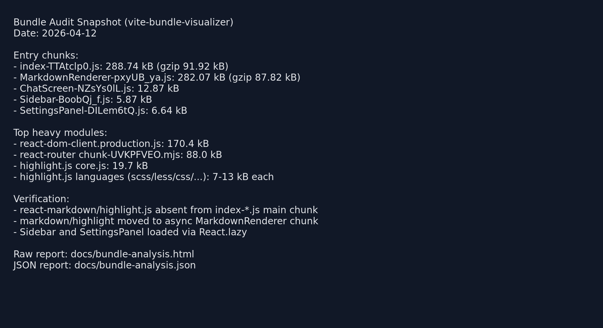

# GigaChat Frontend

## Демо

- Публичный URL: добавьте ваш URL после деплоя на Vercel/Netlify (например, `https://your-project.vercel.app`).
- Скриншот анализа бандла: 
- HTML-отчёт визуализатора: [docs/bundle-analysis.html](docs/bundle-analysis.html)

## Стек

- React 19
- TypeScript 5
- React Router DOM 7
- State management: React Context + useReducer
- Vite 8
- Vitest + React Testing Library
- CSS Modules + global theme variables
- Markdown/rendering: react-markdown + rehype-highlight + highlight.js (вынесены в lazy chunk)

## Запуск локально

1. Клонируйте репозиторий:

```bash
git clone <repo-url>
cd JSProject
```

2. Установите зависимости:

```bash
npm install
```

3. Создайте `.env` на основе шаблона:

```bash
cp .env.example .env
```

4. Заполните переменные окружения.

5. Запустите dev-сервер:

```bash
npm run dev
```

6. Запуск тестов:

```bash
npm test
```

7. Аудит бандла:

```bash
npm run analyze:bundle
```

## Переменные окружения

| Переменная | Описание | Пример |
|---|---|---|
| `VITE_GIGACHAT_CREDENTIALS` | Base64-строка `client_id:client_secret`, используется для OAuth | `base64(...)` |
| `VITE_GIGACHAT_SCOPE` | Scope для OAuth (`GIGACHAT_API_PERS`, `GIGACHAT_API_B2B`, `GIGACHAT_API_CORP`) | `GIGACHAT_API_PERS` |
| `VITE_GIGACHAT_AUTH_URL` | URL OAuth endpoint через прокси | `/proxy/gigachat/oauth` |
| `VITE_GIGACHAT_API_URL` | URL endpoint chat/completions через прокси | `/proxy/gigachat/chat/completions` |

Важно: реальные креды и токены не хранятся в коде и не коммитятся в репозиторий.

## Оптимизации и устойчивость

- Bundle audit:
  - Использован `vite-bundle-visualizer`.
  - Самые тяжёлые зависимости: `react-dom`, `react-router`, `highlight.js`.
  - Проверено, что `react-markdown` и `highlight.js` вынесены в отдельный async chunk `MarkdownRenderer-*` и отсутствуют в `dist/assets/index-*.js`.
- Ререндеры:
  - `ChatItem` обёрнут в `React.memo`.
  - фильтрация чатов в Sidebar через `useMemo`.
  - `onSend`, `onRename`, `onDelete`, `onSelect`, `onNewChat` стабилизированы через `useCallback`.
- Code splitting:
  - `Sidebar` и `SettingsPanel` подключаются через `React.lazy + Suspense`.
  - роуты `/` и `/chat/:id` загружаются через lazy route modules.
- Error handling:
  - добавлен классовый `ErrorBoundary` (`componentDidCatch`) для области сообщений.
  - API-ошибки показываются под полем ввода через `ErrorMessage`.
  - есть кнопка `Повторить` для UI-ошибок.

## Деплой

- Подготовлен конфиг [vercel.json](vercel.json) с:
  - rewrites для SPA-маршрутов (`/(.*) -> /index.html`);
  - проксированием GigaChat endpoints;
- Шаблон env: [.env.example](.env.example).

Перед публикацией:

1. Добавьте env-переменные в Vercel/Netlify settings.
2. Задеплойте проект.
3. Проверьте маршруты `/` и `/chat/:id` в обычном и инкогнито-режиме.

## Тесты

Покрытие тестами:

- reducer: `CREATE_CHAT`, `ADD_MESSAGE`, `DELETE_CHAT`, `RENAME_CHAT`;
- `InputArea`: отправка по кнопке и Enter, disabled при пустом вводе;
- `Message`: user/assistant рендер и кнопка копирования только для assistant;
- `Sidebar`: фильтрация поиска и подтверждение удаления;
- `storage`: сохранение, восстановление, обработка невалидного JSON.
